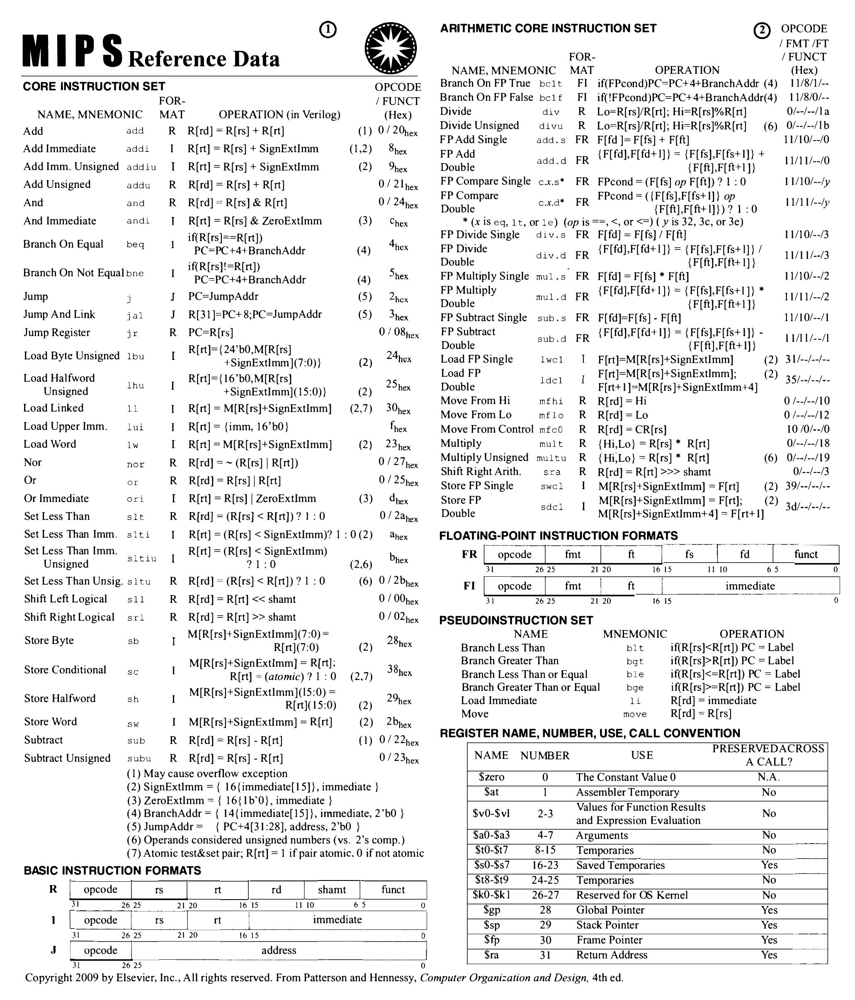
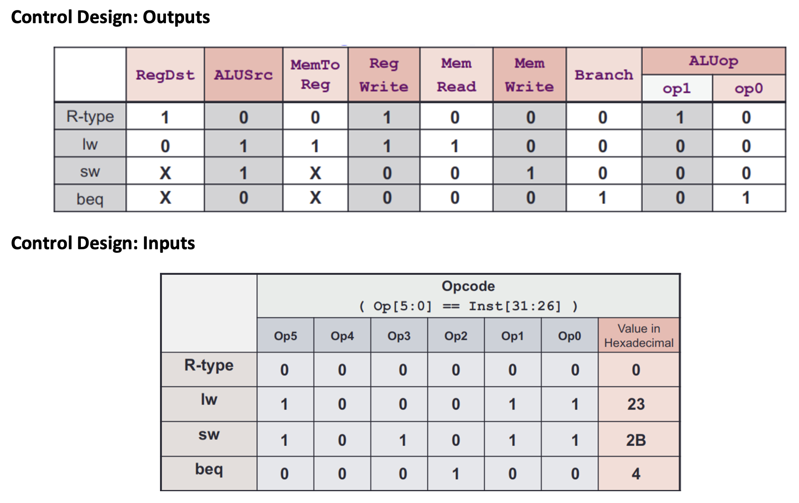
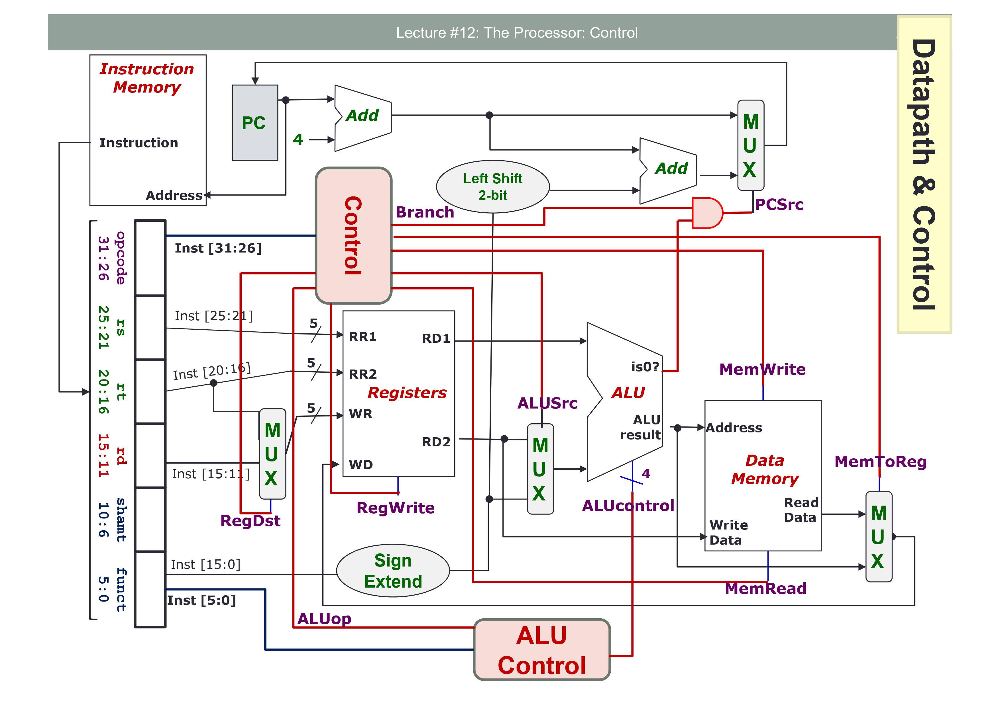
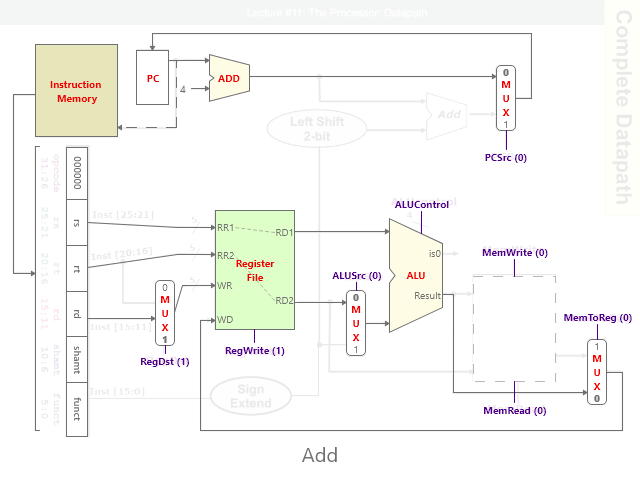
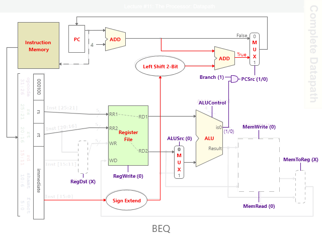
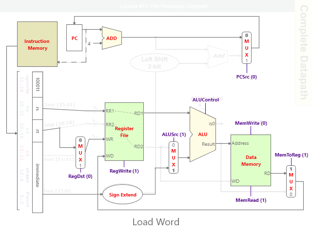
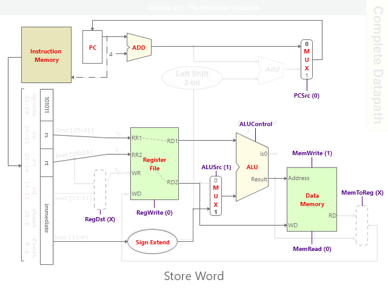
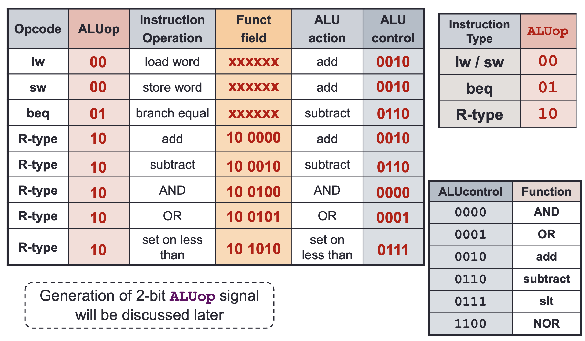
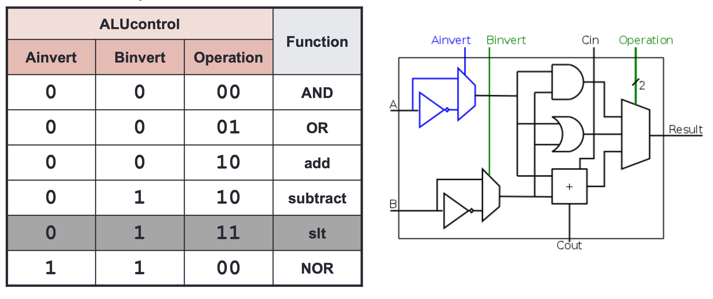

    github.com/tangboxuan

## Number Systems

|System|Value|-x|Negation|Addition|Overflow
|:---:|:---:|:---:|:---:|:---:|:---:
|Sign & Magnitude|||Invert first bit|
|1s Complement|+ve: same as 2s -ve: 2s + 1|2^n - x - 1|Invert all bits|If MSB carry out: +=1|Result opposite sign of A and B|
|2s Complement|if x[n-1]: -= 2^(n-1) for i in [n-2..0]: if x[i]: += 2^i|2^n - x|Invert all bits + 1|Ignore MSB carry out|MSB carry in != MSB carry out Result opposite sign of A and B|
|Excess-n|x-n
|IEEE 754|(Sign) (1.Mantissa) x 2^Exponent||Invert first bit|1: Sign 8: Ex-127 Exp|--- 23: Mantissa

## MIPS

|Operation| RR1| RR2| WR| WD| Opr1| Opr2| Address| Write Data|
|:---:|:---:|:---:|:---:|:---:|:---:|:---:|:---:|:---:
|lw $a, x($b)|	$b|	$a|	$a|	Mem([$b] +x)| [$b]|	x|	[$b] + x	|[$a]|
|beq $a,$b, immd|	$a|	$b|	$b|	? |	[$a]|	[$b]|	[$a] - [$b]|	[$b]|
|sub $a, $b, $c|	$b|	$c|	$a|	[$b] – [$c]|	[$b]|	[$c]|	[$b] – [$c]|	[$c]|
|addi $a, $b, immd|	$b|	$a|	$a| [$b] + immd| [$b]| immd| [$b]	+ immd| [$a]						

## Links

[Hexadecimal to Float](https://babbage.cs.qc.cuny.edu/IEEE-754.old/32bit.html)  
[Hexadecimal-Binary-Decimal](https://www.rapidtables.com/convert/number/binary-to-hex.html)  
[XOR](http://xor.pw/#)  
[Bitwise Calculator](https://miniwebtool.com/bitwise-calculator/)  
[Instructions to Hexadecimal](https://www.eg.bucknell.edu/~csci320/mips_web/)  
